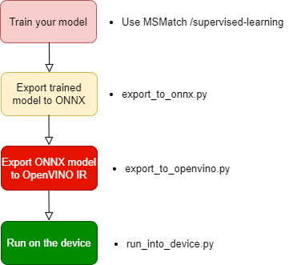
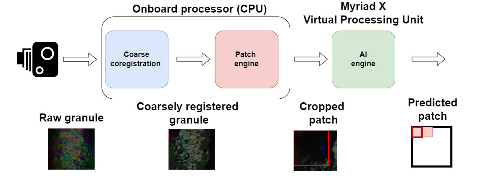

# E2E
### E2E: End-to-end training on S-2 RAW data
# About the project

## 🛰️ E2E: Onboard classification of Thermal Anomalies on Raw Sentinel-2 Data

The END2END project studies the problem of performing on-board satellite thermal anomalies classification on Sentinel-2 [Raw data](https://github.com/ESA-PhiLab/PyRawS#sentinel-2-raw-data).
It provides a complete codebase that enables users to replicate experiments, train and test an [EfficientNet-lite-0](https://blog.tensorflow.org/2020/03/higher-accuracy-on-vision-models-with-efficientnet-lite.html) architecture for the classification of thermal anomalies.


## 🚀👨‍🚀 Easy Reproduction and Quick Adoption

END2END is based on the source code of [MSMatch](https://github.com/gomezzz/MSMatch), which was appropriately retailored for our purposes. Indeed, to train the EfficientNet-lite-0 models both semi-supervised and fully-supervised learning where investigated.

<!-- TABLE OF CONTENTS -->
<details open="open">
  <summary>Table of Contents</summary>
  <ol>
    <li><a href="#about-the-project">About the Project</a>
    <ul>
      <li><a href="#END2END#%EF%B8%8F-end2end-onboard-detection-of-thermal-anomalies-on-raw-sentinel-2-data">END2END: Onboard classification of Thermal Anomalies on Raw Sentinel-2 Data</a></li>
      <li><a href="#easy-reproduction-and-quick-adoption">Easy Reproduction and Quick Adoption</a></li>
    </ul>
    </li>
    <li><a href="#content-of-the-repository">Content of the repository</a></li>
    <li><a href="#installation">Installation</a>
    <ul>
      <li><a href="#create-the-end2end-environment">Create the end2end environment</a></li>
      <li><a href="#set-up-for-the-training-pipeline">Set-up for the training pipeline</a></li>
      <li><a href="#set-up-for-the-embedded-hardware-implementation">Set-up for the embedded hardware implementation</a></li>
    </ul>
    </li>
    <li><a href="#end2end-datasets">END2END datasets</a></li>
    <li><a href="#modifications-of-the-original-msmatch-pipeline">Modifications of the original MSMatch pipeline</a></li>
    <li><a href="#workflow-to-implement-a-trained-model-on-the-edge-device">Workflow to implement a trained model on the edge device </a></li>
    <li><a href="#contributing">Contributing</a></li>
    <li><a href="#license">License</a></li>
    <li><a href="#contact">Contact</a></li>
  </ol>
</details>

## Content of the Repository
The END2END reportyory includes the following directories:

- **MSMatch**: it contains the algorithms and the scripts used for training the model. As previously specified, the model was trained by leveraging the [MSMatch](https://github.com/gomezzz/MSMatch) appopriately modified to perform both supevised-learning and semi-supervised learning on our dataset. In particular, it contains the following subdirectories:

1. `datasets`: it contains the description of the datasets used for our work plus other files inherited from the original MSMatch repository. The files of interests are `thraws_train_dataset.py` (patch classification train and cross_validation splits) and  `thraws_test_dataset.py` (patch classification test split). For more information, on how to set-up the training pipeline, please check [Set-up for the training pipeline](set-up-for-the-embedded-hardware-implementation).

2. `models`: contains the description of the AI models used for training and the `fixmatch` pipeline on which the original MSMatch pipeline is based.

3. `notebooks`: it contains various useful notebooks. In particular, you can use `parse_results.ipynb` to extracts the results from the trained models.

4. `runscripts`: it contains the scripts used to run the training and evaluation. In particular, `run_train.sh` runs the training by using semi-supervised learning. To do that, part of the training split is used as unsupervised data.  `run_train_supervised.sh` disables the unsupervised loss in MSMatch by running supervised-training only by the entire training dataset as labelled data. Finally, `run_eval.py` permits evaluating a single model on the test dataset.

- **ncs2**: it contains the files to implement a model on the [Intel® Neural Compute Stick 2](https://www.intel.com/content/www/us/en/developer/articles/tool/neural-compute-stick.html). Please, refer to (Set-up for the embedded hardware implementation)[#set-up-for-the-embedded-hardware-implementation] to know how to set-up the environment to use the NCS2.
- **onboard prototype**: it contains the utils to implement the [Onboard payload prototype](#onboard-payload-prototype).
- **resources**: it contains various resources for the END2END repositories (e.g., images).


## Installation
### Pre-requirements
Before all, clone this repository. We suggest using git from CLI, execute:

``` git clone https://github.com/ESA-PhiLab/PyRawS ```

### Create the end2end environment
To install the environment, we suggest to use [anaconda]("https://www.anaconda.com/products/distribution"). You can create a dedicated conda environment by running the following command from the main directory: 

``` source install.sh ```

To activate your environment, please execute:

``` conda activate end2end ```

### Set-up for the training pipeline
To set-up the MSMatch pipeline, please, proceed as follows:

1. Download the patch-classification dataset from [here (temporary)](https://drive.google.com/drive/folders/1Fa6-3_mW7-4V_gMIehxq0qU4Epn3WxyB?usp=drive_link). Please, refer to [END2END datasets](#end2end-datasets) for more information on the datasets.

2. Create a directory `data` into `MSMatch` and place the dataset into `MSMatch/data`. If you want to use another directory for your dataset, then you need to adjust the train and test paths into the `thraws_train_dataset.py` and  `thraws_test_dataset.py` files. Please, refer to [Content of the repository](#content-of-the-repository.)

3. If you want to use `supervised learning` open the `run_train_supervised.sh` script, which is located in `MSMatch\runscripts`. Then, proceed as follows:

* If you want to use GPUs, set-up the `CUDA_VISIBLE_DEVICES` with the number of GPU used.
* Adjust the `FIXMATCH_FOLDER` variable with the absolute path of the `MSMatch` folder.
* Adjust the `SAVE_LOCATION` variable with the absolute path to the whole training results.
* Adjust `SAVE_DIR` with the name of the current experiment to contain the results of the training. For instance, if `SAVE_LOCATION="/home/my_home/END2END/checkpoints` and `SAVE_DIR=current_experiment`, the next training will be saved into `/home/my_home/END2END/checkpoints/current_experiment`.
* Adjust `SEED` to set-up the seed used to perform geographical-splitting of the training set. Please, refer to [modifications of the original MSMatch pipeline](#modifications-of-the-original-msmatch-pipeline).

If you want to use `semi-supervised learning` (based on `FixMatch` as in the original MSMatch implementation), open the `run_train.sh` script and proceed as above.  For both the scripts, the other variables are specific training hyper-parameters that you should not edit, if you want to reproduce our results.

To launch the training, from `runscripts` launch one of the following commands:

```source run_train.sh``` or ```source run_train_supervised.sh```


### Set-up for the embedded hardware implementation
We have implemented a prototype on the [Intel Neural Compute Stick 2 (NCS2)](https://www.intel.com/content/www/us/en/developer/articles/tool/neural-compute-stick.html). <br>
If you also want to use the files in the `ncs2` directory, you need to install [OPENVINOv 2022.1](https://www.intel.com/content/www/us/en/developer/tools/openvino-toolkit/download.html). We proceeded as follow to install successfully the software needed to interface the NCS2 device on Windows:

1. Select version 2022.1 and download the offline installer.
2. Install openvino through the downloaded offline installer. By default, it should produce the a directory called "Intel".
3. Install openvino in the `end2end` conda environment through:

```pip install openvino==2022.1````

4. Install numpy==1.23.4 in the conda environment.

5. Copy the content of `Intel\openvino_2022.1.0.643\runtime\bin\intel64\Release` into your
   `$CONDA_PATH\envs\end2end\Lib\site-packages\openvino\libs`

6. Export `$CONDA_PATH\envs\end2end\Lib\site-packages\openvino\libs` to PATH

7. It is necessary to install `openvino-dev` that is necessary to export models to openvino IR format. To this aim, we use python virtual env to avoid conflicts. Please, proceed as follows:

* Navigate to the `ncs2` directory.
* Crete a virtual environment called `openvino_env` through: ```python -m env openvino_env```
* Activate the virtual environment through: ```openvino_env\Scripts\activate```
* Install `openvino-dev` through: ```pip install openvino-dev```

Now, you should be able to work with the NCS2 device.

Everytime you need to use ```export_to_openvino.py```, remember to activate the virtual environment.

## END2END datasets
The dataset used for END2END is based on [THRawS](https://arxiv.org/abs/2305.11891). `THRawS` (Thermal Hotspots on Raw Sentinel-2 data) is a Sentinel-2 dataset containing raw granules including annotated thermal anomalies. <br>
In particular:
- to train the model, the bands [`B8A`, `B11`, `B12`] of the various granules of `THRawS` was preprocessed to extract 256x256 patches for thermal anomalies classification. To this aim, `ROBERTO TO COMPLETE`.
The patch classification dataset can be downloaded from [here]([https://drive.google.com/drive/folders/1Fa6-3_mW7-4V_gMIehxq0qU4Epn3WxyB?usp=drive_link](https://huggingface.co/datasets/sirbastiano94/END2END/blob/main/README.md)).

- for the [onboard payload prototype](#onboard-payload-prototype), the bands [`B8A`, `B11`, `B12`] of [Sentinel-2 Raw granules](https://github.com/ESA-PhiLab/PyRawS#sentinel-2-raw-granule) are grouped in a [TIF](https://en.wikipedia.org/wiki/TIFF) file, representing an easy-to-read version of the THRawS granules without metadata.

## Modifications of the original MSMatch pipeline
The modifications of the original MSMAtch pipeline include:

- Addition of variable upsampling of the strongly unbalanced `event` class. The upsampling factor is specified in the `run_train.sh`/`run_train_supervised.sh` scripts (i.e., `TRAIN_UPS_EVENT`).

- Addition of weighting factors on the loss to stabilize training because of the highly-classes umbalances.

- Use of the [Matthews correlation coefficient (MCC)](https://static.hlt.bme.hu/semantics/external/pages/jel%C3%B6letlen/en.wikipedia.org/wiki/Matthews_correlation_coefficient-2.html) to assess the model performance and to select the trained model during the training (i.e., a model is kept during the training if it outperforms the previous one in temrs of the MCC performance on the cross-evaluation dataset).

- No channel-based normalization of data.

## Workflow to implement a trained model on the edge device
Once you have trained your model, you can implement the trained model on the edge device as follows:
<p align="center">
  
</p>

## Onboard payload prototype
<p align="center">
  
</p>

In the frame of the END2END project, we aim to implement a mock-up of a full on-board payload processing chain from the sensor to the classification with minimal pre-processing. <br>
The processing chain includes:

- **Coarse spatial bands registration**: it is a simple but coarse bands registration technique based on the solution described in the [THRawS](https://arxiv.org/abs/2305.11891) paper. The coregistration technique is lightweight and consists of a simple spatial shift that compensates the average [along-track, across-track] displacements between each couple of bands. The coarse band registratio is performed in an onboard processor.

- **Demosaicking**: this steps simply splits an entire [Sentinel-2 Raw granule](https://github.com/ESA-PhiLab/PyRawS#sentinel-2-raw-granule) into 256x256 patches. The `patch engine` is responsible for performing the granule demosaicking and is implemented in the onboard processor

- **AI inference**: the `AI engine` consists of a trained AI EfficientNet-lite-0 model that processes the cropped 256x256 patches. After being compiled through the dedicated [workflow](#workflow-to-implement-a-trained-model-on-the-edge-device), the dedicated `OpenVino IR` file can be deployed on the `Intel NCS2` or `CogniSat` board.

- **Mosaicking**: the results are, then, mosaicked to allineate each prediction to each corresponding patch.

The onboard payload prototype processing chain can be now profiled to measure the total processing time.

## Contributing
The ```END2END``` project is open to contributions. To discuss new ideas and applications, please, reach us via email (please, refer to [Contact](#contact)). To report a bug or request a new feature, please, open an [issue](https://github.com/GabrieleMeoni/END2END/issues) to report a bug or to request a new feature.

If you want to contribute, please proceed as follow:

1. Pick one of the open issues or open an issue yourself.
2. Fork the Project
3. Create your Feature Branch (`git checkout -b feature/NewFeature`)
4. Commit your Changes (`git commit -m 'Create NewFeature'`)
5. Push to the Branch (`git push origin feature/NewFeature`)
6. Open a Pull Request and specify the opened issue that you want to address.

## License
Distributed under the GPL-3.0 License.

## Contact
Created by the European Space Agency $\Phi$-[lab](https://phi.esa.int/) in collaboration with [Space Systems Engineering, Technical University of Delft](https://www.tudelft.nl/lr/organisatie/afdelingen/space-engineering/space-systems-engineering).

* Gabriele Meoni - Currently with ESA: gabriele.meoni at esa.int
* Roberto Del Prete - roberto.delprete at esa.int
